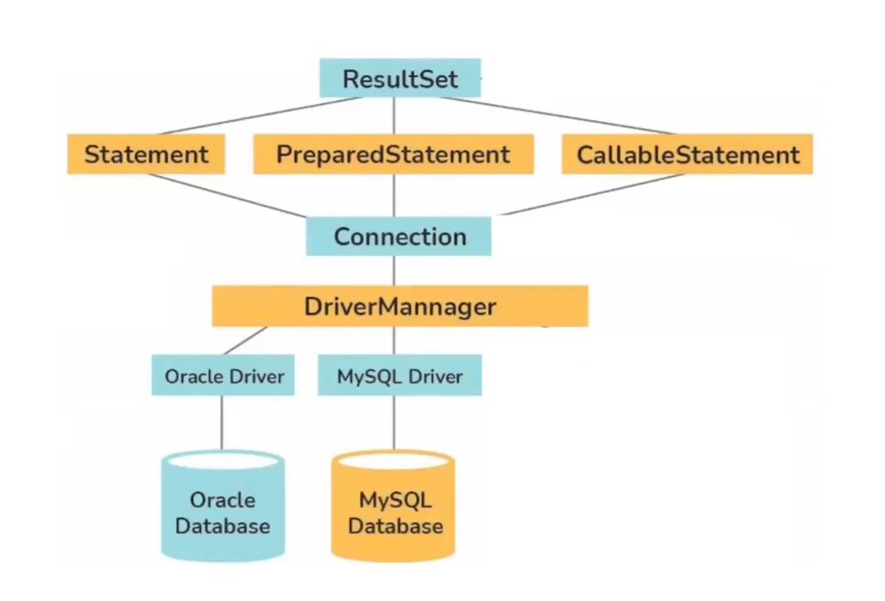

****Лекция 3****

Работаем с RDBMS из тестов: JDBC

Это апи в самой джаве, с которого можно работать с реляционными базами данных (еще с Java SE)
Любая библиотека с базами данных работает на базе jdbc.

JDBC юзается для супер-сложных и для супер-легких задач. 
Для средних задач используются надстройки - hibernate/spring data etc

В тестах используются сложные задачи -> JDBC используем в тестах
Архитектура:

в JDBC все базируется на интерфесах. Первый интерфейс - dataSource, следующий - connection и наконец result-set
DataSource лежит в driverManger

реализация для каждой зависимости реализована через интерфейс, с имплементацией любой БД (постгре/оракл/май)

Глобально dataSource хранит в себе данные, как получить физический доступ к БД. У одного dataSource - всегда одно подключение (инстанс) к БД.
Он синглтон
Синглтон - это такой объект, который хранит в себе только один инстанс класса.
Это максимально близкая к БД абстракция. В результате мы получаем connection.

Connection - объект, который привязан к нашей бд/к нашим ресурсам. Нужна для того, что бы делать statement. (в 95%используется preparedStatement)
Statement - это абстракция над SQL запросом, который будет выполнен к базе.
ResultSet - интерфейс, представляющий абстракцию над данными, которыми вернул SQL запрос (update/insert/select). Иными словами, все что, мы можем вернуть.
Поток в connection/statement/result нужно всегда закрывать. 

1) добавляем в зависимости драйвер в билд граддл
2) Подключение к данным в yml-файле используется:
   datasource:
        url: префикс(jdbc):название драйвера(postgres)://путь к бд /имя бд
        username: postgres
        password: password
3) прописываем в enum урлы подключения ко всем базам данных (чтобы можно было из одной точки переключаться между ними)
4) реализуем метод, который сможет создавать один единственный dataSource (синглтон) и через него обращаться к нужным нам базам данных
5) Далее определяем connection. Он нужен будет для использования в классах, которые будут отвечать за логику взаимодействия с БД. Есть принятое название - DAO/Репозиторий. Это абстракция. Принято абстрагировать реализацию конкретной базы от интерфейса взаимодействия с данными 
    При любой работе с бд из java - любая таблица с полями - это поля объекта в java (маппинг)
   Суффикс Entity - это объекты, которые являются представлением к базе с ее полями

